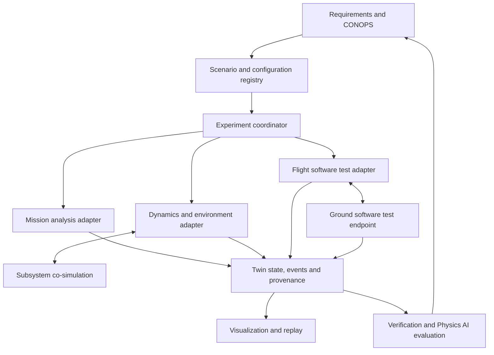

# jfxai4mlrss --- OpenTwin AI Space Flight & Modular Launch Simulation Platform

> Open-source-oriented reference architecture for spaceflight
> simulation, modular launch systems, mission analysis, flight software,
> aerospace digital twins, Physics AI, MBSE, and end-to-end virtual
> verification.

## Description and Context

**jfxai4mlrss / OpenTwin AI Space Flight & Modular Launch Simulation
Platform** consolidates the original project's spaceflight-simulation
technology survey into a structured architecture for mission analysis,
launch-vehicle simulation, flight dynamics, avionics, reusable flight
software, robotics co-simulation, scientific machine learning, and
aerospace digital twins.

The source project identifies itself as an **AI-Powered Space Flight
Simulation Platform** and references OpenSASI, GMAT, Orbiter, Adamant,
sfsim, LunCo, OpenSpace, NVIDIA PhysicsNeMo, LBR-26 ground software,
Astraeus-I avionics, rocket flight-computer software, Lambda-4S
references, nonlinear hypersonic flight dynamics, EnSim, MAPLEAF,
Cambridge rocketry simulation, TrinetraOne, RocketPy, JSBSim, FreeCAD
Rocketry Workbench, Aerobee references, FC-Udev Flight Software,
NASA/JSBSim test cases, cFS, and F´.

This consolidation classifies those projects as **candidate
integrations, engineering references, or research references**, rather
than one mandatory software distribution.

## Vision

``` text
MISSION / CONOPS / REQUIREMENTS
             |
       OPENTWIN AEROSPACE
             |
 +-----------+-----------+-----------+
 |           |           |           |
MISSION    VEHICLE     AVIONICS    GROUND
ANALYSIS   DYNAMICS    & FSW       SYSTEMS
 |           |           |           |
 +-----------+-----------+-----------+
             |
      DIGITAL TWIN CORE
 State | Events | Models | Provenance
             |
 +-----------+-----------+-----------+
 |           |           |           |
6-DOF      CFD/FEA     PHYSICS AI   ROBOTICS
SIM        PROPULSION   SciML        CO-SIM
             |
      MBSE / CAD / CAM / CAS
             |
 VERIFICATION / MISSION REHEARSAL
```

## Objectives

-   Provide an open modular architecture for aerospace simulation.
-   Support mission and trajectory analysis.
-   Support reusable and modular launch-system studies.
-   Represent vehicles, stages, payloads, avionics and ground systems as
    digital twins.
-   Integrate 6-DOF flight dynamics and atmospheric models.
-   Support propulsion and aerodynamic analysis through replaceable
    adapters.
-   Integrate reusable flight-software frameworks.
-   Enable robotics and system-level co-simulation.
-   Apply Physics AI/SciML to validated engineering workflows.
-   Preserve model, simulation and AI provenance.
-   Connect MBSE requirements to simulation and verification artifacts.
-   Minimize proprietary lock-in.

## Reference Architecture

**Integration status:** this is a reference architecture for civil spaceflight,
student research and virtual verification. Catalog entries describe upstream
resources; the jfxai4mlrss adapters below are proposed, not implemented or
validated by this documentation update. Source review date: 2026-09-20.



| Layer | Responsibility | Candidate technologies |
| --- | --- | --- |
| Requirements and configuration | CONOPS, model identities, versioned scenarios and requirement-to-test links | Capella/Arcadia, OpenTwin registry |
| Mission analysis | Scenario preparation and orbital-analysis products | General Mission Analysis Tool (GMAT) |
| Dynamics | One authoritative state propagator per simulated entity and phase | RocketPy, MAPLEAF, Cambridge simulators, JSBSim; other tools under separate profiles |
| Subsystems and robotics | Multidomain models and system-level interaction | LunCo; proposed Modelica/FMI boundary where supported |
| Flight software | Host-based application execution, simulated I/O and test evidence | cFS, F´, Adamant |
| Ground segment | Decode, display, record and replay simulated telemetry | LBR-26, framework-specific ground tools |
| Scene and presentation | Human-readable mission/world visualization | Orbiter, sfsim, OpenSpace, optional FlightGear |
| Data and evaluation | Run archive, comparison, uncertainty and surrogate assessment | OpenTwin provenance, NVIDIA PhysicsNeMo |

These components are alternatives or complementary services, not a mandatory
single stack. A renderer is not automatically a validated dynamics engine.
A flight-software framework is not a spacecraft model. A public hardware
design is not a portable software driver.

### Boundary contracts

| Contract | Required information |
| --- | --- |
| Model identity | Model and asset IDs, upstream revision, license, configuration hash, intended use and fidelity limits |
| State | Simulation timestamp, reference frame, central body, position/velocity, attitude convention, units and validity |
| Time | Epoch, time scale, simulation versus wall clock, step policy and reset semantics |
| Environment | Atmosphere/gravity/ephemeris source, version, applicable domain and assumptions |
| Telemetry | Dictionary version, field ID/type/unit, acquisition time, source, sequence and quality flags |
| Simulated commands | Schema version, destination test endpoint, correlation ID and acknowledgment state |
| Events | Event ID/type, source entity, simulation time, configuration revision and causal reference |
| Results | Inputs, seeds, solver settings, software versions, outputs, uncertainty and verification evidence |

Use SI units at canonical interfaces and explicit conversion at tool
boundaries. Label inertial, Earth-fixed, local and body frames; specify
quaternion ordering and altitude datum. UTC, TAI and TT are not interchangeable.
Preserve the selected ephemeris and time-conversion data with a run.

The coordinator owns the simulation clock and lifecycle: configure,
initialize, ready, run, pause, reset and stop. Batch studies, interactive
visualization and hardware-paced tests require separate timing policies.
Declare a single state owner and reject incompatible configurations.

### Integration paths

| Path | Proposed exchange | Admission condition |
| --- | --- | --- |
| Mission tool to run archive | Versioned initial conditions and ephemeris/result files | Explicit frames, epoch, units and tool-specific import/export mapping |
| Dynamics engine to twin | State snapshots and lifecycle events | Adapter schema, reproducible initialization and solver-domain checks |
| CAD to model registry | Geometry/configuration references and derived properties | Unit checks and reviewed mass-property provenance; no automatic fidelity claim |
| Subsystems to coordinator | Typed service or qualified FMU interface | Tool support, solver ownership and coupling tests |
| FSW to simulated hardware | Framework-specific drivers and synthetic sensor data | Target/toolchain pinning, deterministic fixtures and dictionary mapping |
| Ground endpoint to twin | Decoded telemetry and replay records | Schema/version agreement and transport qualification |
| Twin to viewer | Read-only state/ephemeris presentation | Correct frame/time conversion; interpolation does not overwrite physics |
| Run archive to Physics AI | Versioned datasets and reference results | Separate training/evaluation data and declared validity envelope |

Begin with offline file exchange and recorded replay. Add live co-simulation
only after boundary tests pass. Shared use of TCP, UDP, protobuf or FMI does
not guarantee compatible data semantics.

### Execution profiles

| Profile | Initial composition | Deliverable |
| --- | --- | --- |
| Mission analysis | GMAT plus result import and OpenSpace presentation | Traceable analysis and visualization package |
| Educational dynamics | One qualified RocketPy, MAPLEAF, Cambridge or JSBSim backend | Repeatable simulation record and comparison report |
| Virtual spaceflight | Orbiter or sfsim with an explicit state adapter | Interactive scenario with documented physics limitations |
| Robotics / CONOPS | LunCo and selected supported subsystem models | System-level behavior and event trace |
| FSW software-in-the-loop | One of cFS, F´ or Adamant with synthetic I/O | Host-based tests and telemetry replay |
| Ground-system replay | LBR-26 virtual mode or framework-specific ground tools | Recorded-data decoding and interface checks |
| Physics AI evaluation | PhysicsNeMo and a frozen reference dataset | Error, uncertainty and out-of-domain report |

Cross-cutting concerns remain configuration management, reproducibility,
observability, verification and provenance.

## OpenTwin Aerospace Model

Candidate twins include:

-   Mission Twin
-   Carrier Aircraft Twin
-   Launch Vehicle Twin
-   Rocket Stage Twin
-   Payload Twin
-   Propulsion Twin
-   Avionics Twin
-   Flight Software Twin
-   Ground Segment Twin
-   Atmospheric Environment Twin
-   Orbital Environment Twin

``` yaml
twin:
  id: launch-vehicle-001
  type: modular-launch-vehicle
  configuration:
    stages: []
    payload: {}
    propulsion: {}
    avionics: {}
  state:
    flight_phase: preflight
    position: {}
    velocity: {}
    attitude: {}
    health: {}
  model_refs: []
  telemetry_refs: []
  verification_refs: []
  provenance: {}
```

## Mission, Dynamics and Simulation

The architecture can support mission definition, launch windows,
atmospheric ascent, staging, generic air-launch separation, orbital
insertion, payload deployment, mission rehearsal, Monte Carlo analysis,
6-DOF dynamics, atmospheric models, aerodynamic coefficients, propulsion
models and validated surrogate models.

``` text
Mission Requirements
        |
      CONOPS
        |
Trajectory Design
        |
Vehicle Configuration
        |
Simulation
        |
Verification
        |
Mission Plan
```

## Flight Software and Avionics

Treat cFS, F´ and Adamant as **alternative framework profiles** with different
component models, runtimes, build systems and telemetry definitions. Their
applications are not binary-compatible plug-ins.

| Framework | Upstream architecture | jfxai4mlrss integration proposal |
| --- | --- | --- |
| cFS | OSAL, Platform Support Package (PSP), Central Flight Executive (cFE), libraries and applications | Pin the bundle and submodules; host-based test application, simulated drivers and telemetry adapter |
| F´ / F Prime | Component-driven C++ framework, modeled interfaces, generated code and testing tools | Versioned topology and dictionaries, synthetic components and ground-test adapter |
| Adamant | YAML-based component models, generated structure and handwritten Ada behavior | Pin compiler/generator versions and map typed component outputs to twin records |

The [public cFS bundle](https://github.com/nasa/cFS) explicitly distinguishes
its example/lab configuration from a mission-specific flight distribution.
Successful execution of a sample does not validate a complete mission system.

Astraeus-I, HPR flight-computer software and FC-Udev are hardware or embedded
software references. Any later board profile must identify exact revision,
driver interfaces and test evidence; no compatibility with cFS, F´ or Adamant
is assumed.

For the initial profile, synthetic sensor fixtures and virtual ground
endpoints exercise telemetry, event handling, timing and reset. Record the
FSW build, packet dictionary, simulated hardware configuration and scenario
together. LBR-26's reviewed implementation offers virtual/hardware modes and
recorded-data replay; use the virtual/replay path for the documentation MVP.

## Digital Twin Evidence and Validation

A standalone simulated vehicle is a virtual model. A connected digital twin
also requires an identified asset, configuration correspondence, synchronized
observations and an explicit account of uncertainty.

| Gate | Evidence required |
| --- | --- |
| Source | Identified upstream, pinned revision, code/data/asset license and dependency inventory |
| Model | Intended use, assumptions, fidelity envelope and reference cases |
| Interface | Units, frames, clock, schema compatibility, reset and stale-data behavior |
| Numerical | Appropriate reference comparisons, solver sensitivity and reproducibility tolerances |
| FSW/ground | Simulated I/O traces, dictionary consistency, replay and error-handling tests |
| AI | Dataset provenance, held-out evaluation, error limits and out-of-domain detection |
| Release | Requirement-to-test traceability, limitations and repeatable build/run manifest |

Track status separately as **cataloged**, **adapter implemented**,
**integration tested**, and **validated for a named use case**. This change
only updates the architecture and catalog. NASA-derived check cases can help
verify selected numerical behavior; they do not certify every vehicle model.

## Physics AI and Scientific Machine Learning

Potential research uses include surrogate physics models, reduced-order
simulation, aerodynamic approximation, parameter estimation, uncertainty
studies, anomaly detection and accelerated simulation.

AI surrogate models should be compared against validated numerical,
experimental or flight-test references before engineering use.

## Modular Air-Launch Concept

The OpenTwin extension supports a **generic, independently engineered
modular air-launch architecture**:

``` text
Carrier Aircraft Twin
        |
Mission / Release Envelope
        |
Separation Event Twin
        |
Modular Launch Vehicle Twin
        |
Stage / Propulsion Twins
        |
Payload Twin
        |
Trajectory / Orbit Twin
```

This is a conceptual digital-engineering architecture, not a claim of
implementation or certification of any depicted reference vehicle.

## MBSE → CAD → CAM → CAS

The source repository organizes engineering around:

``` text
MBSE -> CAD -> CAM -> CAS
```

Arcadia/Capella can structure stakeholder needs, operational analysis,
system analysis, logical architecture, physical architecture and
verification traceability. CAD can cover airframes, stages, payload
interfaces, avionics packaging and generic propulsion geometry; CAM can
represent manufacturing/assembly planning; CAS provides end-to-end
virtual simulation and performance analysis.

## Open-Source Technology Compendium

All resources below are optional candidates or references. Links identify
reviewed upstream material, not working jfxai4mlrss integrations. Preserve the
difference between source-code licensing, data/asset rights, hardware
documentation and proprietary runtime requirements.

### 1. Student space initiatives and historical references

| Resource | Category and proposed role | Qualification |
| --- | --- | --- |
| OpenSASI — Open Student-Amateur Space Initiative | Requested student/amateur space initiative reference | Exact authoritative project URL and license remain unresolved; retain in the research backlog |
| [Lambda-4S](https://github.com/open-aerospace/Lambda-4S) | Historical orbital-launch-vehicle data and drawings | Reference collection, not a simulation engine; review individual sources and do not repeat unverified size/ranking claims |
| [Aerobee / Aerobee 150A](https://github.com/open-aerospace/Aerobee-150) | Historical sounding-rocket digital reconstruction | Separate reconstruction code/graphics from original documentation and its rights |
| [TrinetraOne](https://github.com/ChinmayBhattt/TrinetraOne-OpenRocket) | Example vehicle project modeled using OpenRocket | A design asset/project, not an independent physics framework or validated reference case |

### 2. Mission analysis and interactive spaceflight

| Resource | Proposed role | Qualification |
| --- | --- | --- |
| [General Mission Analysis Tool (GMAT)](https://software.nasa.gov/software/GSC-17177-1) | Mission and trajectory-analysis products | NASA catalog identifies the tool; select a specific distribution and document its interfaces before integration |
| [Orbiter](https://github.com/orbitersim/orbiter) | Interactive Newtonian spaceflight simulation | Core MIT license; graphics clients and add-ons have separate terms; qualify build platform and scenario APIs |
| [sfsim](https://github.com/wedesoft/sfsim) | Experimental 3D spaceflight/spaceplane visualization and simulation | Upstream describes work in progress; verify physics scope, graphics requirements and distribution terms |

### 3. Flight dynamics and trajectory frameworks

| Resource | Proposed role | Qualification |
| --- | --- | --- |
| [MAPLEAF — 6-DOF Rocket Flight Simulation Framework](https://github.com/henrystoldt/MAPLEAF) | Modular dynamics backend candidate | Pin Python/build dependencies and qualify model assumptions; optional rendering/parallel packages are separate |
| [Cambridge Rocketry Simulator](https://github.com/ChrisEilbeck/CambridgeRocketrySimulator) | Legacy six-degree-of-freedom simulator reference | Reviewed repository is a fork of the earlier simulator; retain upstream provenance and GPL terms |
| [CamPyRoS](https://github.com/cuspaceflight/CamPyRoS) | Related Cambridge Python 6DOF simulator candidate | Distinct codebase; dependency/platform support and incomplete features need version-specific review |
| [RocketPy](https://github.com/RocketPy-Team/RocketPy) | Python trajectory-simulation candidate | Validate each model/dataset and adapter; no universal orbital or vehicle-fidelity claim |
| [JSBSim Manager](https://github.com/natronics/JSBSim-Manager) | Notebook/configuration workflow around JSBSim | Prototype orchestration reference, not JSBSim itself; dependency compatibility requires review |
| [JSBSim](https://github.com/JSBSim-Team/jsbsim) | General flight-dynamics engine boundary | Separate engine verification from correctness of individual vehicle models |

### 4. Aerodynamics, propulsion and specialized research

| Resource | Proposed role | Qualification |
| --- | --- | --- |
| [Practical calculation of the aerodynamic characteristics of slender finned vehicles / barrowman](https://github.com/open-aerospace/barrowman) | Analytical-method/software reference | Reviewed README lists features as TODO; implementation completeness and method applicability require independent assessment |
| [HyperSIM — nonlinear hypersonic flight dynamics](https://github.com/F35-Vin-Desh/HyperSIM) | MATLAB/FlightGear academic simulation reference | README describes a 3-DOF vehicle; six ordinary differential equations are not six degrees of freedom. MATLAB/Simulink requirements keep this outside a fully libre execution baseline |
| [EnSim](https://github.com/SpaceEngineerSS/EnSim) | Desktop/Python propulsion-analysis and flight-simulation candidate | Upstream presents preliminary-design and educational analysis; qualify each model and exported result separately |

These entries document research scope and adapter roles. They do not supply
vehicle design parameters, propulsion construction instructions or a
validated end-to-end launch system.

### 5. CAD and system-level robotics co-simulation

| Resource | Proposed role | Qualification |
| --- | --- | --- |
| [FreeCAD Rocketry Workbench](https://github.com/davesrocketshop/Rocket) | Parametric geometry and configuration provenance | Reviewed current workbench requires FreeCAD 1.0; pin a compatible pair and review derived properties before simulation import |
| [LunCo / LunCoSim](https://github.com/LunCoSim/lunco-sim) | System-Level Engineering, robotics co-simulation and CONOPS | Reviewed workbench connects vehicles, environments and subsystem models; fidelity and supported couplings are scenario-specific |
| Arcadia / Capella | Requirements and logical/physical architecture traceability | Proposed links from requirement IDs to model versions and test reports |

### 6. Reusable flight-software frameworks

| Resource | Proposed role | Qualification |
| --- | --- | --- |
| [Adamant](https://github.com/lasp/adamant) | Model-based embedded/flight-software profile | Apache-2.0 framework; YAML generators and Ada behavior require a qualified toolchain |
| [NASA Core Flight System (cFS)](https://github.com/nasa/cFS) | Reusable, mission-independent framework profile | OSAL + PSP + cFE + libraries/apps; pin submodules and distinguish public lab bundle from a mission distribution |
| [F´ / F Prime](https://github.com/nasa/fprime) | Component-driven spaceflight/embedded software profile | Model/code-generation and C++ component ecosystem; mission application and platform validation remain separate |

### 7. Avionics, embedded computers and ground software

| Resource | Proposed role | Qualification |
| --- | --- | --- |
| [LBR-26 Ground Software](https://github.com/Long-Beach-Rocketry/LBR-26-Ground-Software) | Ground-side transport, decoding and replay candidate | Reviewed LoRa module includes virtual mode, local transports, NDJSON replay and protobuf/nanopb generation; schemas need explicit mapping |
| [Astraeus-I avionics development board](https://github.com/Astraeus-Library/Astraeus-I-Board) | Board-level interface and hardware-documentation reference | Schematic/layout repository with CC BY 4.0 indication; firmware and board revisions must be identified separately |
| [Advanced flight computer software for high-powered rockets — HPR Rocket Flight Computer](https://github.com/SparkyVT/HPR-Rocket-Flight-Computer) | Embedded telemetry and flight-computer research reference | Hardware-specific project; upstream performance claims are not jfxai4mlrss verification evidence |
| [FC-Udev Flight Software](https://github.com/Cosmic-Aerospace-Technologies/FC-Udev) | Arduino-oriented model-rocket telemetry/software reference | README states noncommercial/educational availability; resolve license terms before classifying as unrestricted open source or redistributing |

### 8. Astrovisualization and Physics AI

| Resource | Proposed role | Qualification |
| --- | --- | --- |
| [OpenSpace](https://github.com/OpenSpace/OpenSpace) | Astrovisualization of observations, simulation and mission products | Presentation layer; dataset/asset licensing and time/frame mapping need separate checks |
| [NVIDIA PhysicsNeMo](https://github.com/NVIDIA/physicsnemo) | SciML / Physics AI training, fine-tuning and inference experiments | PyTorch-based framework; qualify accelerator dependencies, model/data licenses and numerical evidence. A learned model does not inherit solver validation |

### 9. Verification and provenance references

| Resource | Proposed role | Qualification |
| --- | --- | --- |
| [NASA simulation test cases to JSBSim](https://github.com/open-aerospace/jsbsim-nasa-test-cases) | Candidate numerical regression/reference-case collection | Community attempt to apply NASA-published check cases; not a NASA certification or proof that all cases pass |
| Versioned run archive | Inputs, outputs, seeds, schemas and reference comparisons | Proposed jfxai4mlrss service, not a bundled upstream tool |
| Model and dependency registry | License, revision, fidelity and test status for each component | Admit a component only for explicitly documented profiles |

### Admission and licensing policy

For each candidate record the upstream URL, fork relationship, revision,
license, data/asset rights, runtime, adapter/schema version, intended use,
validation status and open issues. Unresolved identity or license means
**reference only**, not an installed dependency.

A proposed libre baseline can begin with one qualified dynamics backend,
recorded-data exchange and open visualization tools. Keep MATLAB/Simulink
references, restricted-use firmware, hardware-specific dependencies and
unverified model assets in separate optional profiles.

Inclusion does not imply endorsement, bundling, maintenance guarantees,
license compatibility or a tested integration. The OpenSASI source remains
an explicit follow-up item rather than a guessed link.

## User Guide

1.  Define mission and CONOPS.
2.  Create vehicle/stage/payload configurations.
3.  Register OpenTwin entities.
4.  Select validated simulation models.
5.  Configure environment and initial conditions.
6.  Run trajectory/6-DOF simulations.
7.  Connect flight-software models when required.
8.  Record telemetry and simulation events.
9.  Run sensitivity or Monte Carlo studies.
10. Compare outputs with verification references.
11. Review uncertainty and provenance.
12. Export engineering results.

## Installation Guide

``` bash
git clone https://github.com/robotics-intelligent-systems/jfxai4mlrss.git
cd jfxai4mlrss
```

Treat the repository as a technology compendium/reference architecture
unless an individual module provides executable installation
instructions. Do not assume every referenced simulator or framework must
be installed.

## Dependencies

### Required Dependencies

Only components necessary for the selected executable implementation.

### Optional Integrations

GMAT, RocketPy, JSBSim, MAPLEAF, OpenSpace, cFS, F´, FreeCAD, Capella,
Physics AI/SciML frameworks, and robotics/co-simulation systems.

### Research References

Historical vehicles, academic simulators, algorithms, datasets and
experimental tools used for comparison or research without becoming
runtime dependencies.

## Recommended Repository Structure

``` text
jfxai4mlrss/
├── README.md
├── LICENSE
├── CONTRIBUTING.md
├── CODE_OF_CONDUCT.md
├── docs/
├── MBSE/
│   ├── operational/
│   ├── system/
│   ├── logical/
│   ├── physical/
│   ├── CAD/
│   ├── CAM/
│   └── CAS/
├── twins/
│   ├── mission/
│   ├── carrier/
│   ├── launch_vehicle/
│   ├── propulsion/
│   ├── avionics/
│   └── payload/
├── mission/
├── trajectory/
├── dynamics/
├── aerodynamics/
├── propulsion/
├── avionics/
├── flight_software/
├── ground/
├── robotics/
├── physics_ai/
├── simulation/
├── verification/
├── visualization/
├── integrations/
├── api/
├── events/
├── provenance/
├── deployment/
├── tests/
└── examples/
```

## MVP

The initial MVP can provide mission and vehicle configuration, OpenTwin
registry, environment configuration, a trajectory/6-DOF adapter,
simulation event history, model/version provenance and results
visualization.

Success criteria include reproducible missions/configurations, traceable
model versions, stored simulation inputs/outputs, representable
stage/separation events, comparable simulation runs, attached
verification evidence and no mandatory proprietary cloud.

## Development Roadmap

### Phase 1 --- Architecture

-   [x] BID-inspired documentation organization.
-   [x] Source technology consolidation.
-   [x] OpenTwin aerospace architecture.
-   [x] Initial twin taxonomy.
-   [x] Categorized compendium with source links and qualification notes.
-   [x] Integration layers, boundary contracts and execution profiles.
-   [ ] Resolve OpenSASI upstream identity and candidate license gaps.
-   [ ] Architecture Decision Records and formal schemas.

### Phase 2 --- Simulation Core

-   [ ] Mission and vehicle models.
-   [ ] Environment.
-   [ ] 6-DOF and trajectory interfaces.
-   [ ] Results store with model/version provenance and replay.
-   [ ] Canonical time, frame and unit conversion tests.

### Phase 3 --- Digital Twins

-   [ ] Mission, Vehicle, Stage, Payload, Propulsion and Avionics Twins.

### Phase 4 --- Flight Software

-   [ ] Separate cFS, F´ and Adamant profiles and adapters.
-   [ ] SIL workflows.
-   [ ] Telemetry/command and ground interfaces.

### Phase 5 --- Multiphysics

-   [ ] Aerodynamics, propulsion, structural and separation interfaces.

### Phase 6 --- Modular Air Launch

-   [ ] Carrier Twin.
-   [ ] Release-envelope model.
-   [ ] Separation-event model.
-   [ ] Configurable launch-vehicle and payload model.

### Phase 7 --- Physics AI

-   [ ] Surrogates, SciML, uncertainty, provenance and validation gates.

### Phase 8 --- MBSE and Verification

-   [ ] Capella traceability, requirements-to-test links, Monte Carlo
    workflows and verification reports.

### Phase 9 --- Production Hardening

-   [ ] CI/CD, reproducible builds, security analysis, performance
    testing and release governance.

## How to Contribute

Contributions are welcome in mission analysis, orbital mechanics, flight
dynamics, aerospace simulation, avionics, flight software, robotics,
Physics AI, SciML, MBSE, visualization, verification and documentation.

Pull requests should document scope, architecture impact, assumptions,
interfaces, dependencies/licenses, model provenance, verification
evidence, tests and documentation.

Do not commit proprietary aerospace data, export-controlled material,
confidential flight data, credentials or third-party content without
appropriate authorization.

## Code of Conduct

Maintain a respectful, inclusive, professional and technically
constructive environment. A dedicated `CODE_OF_CONDUCT.md` is
recommended.

## Authors and Maintainers

Maintained by the **Robotics Intelligent Systems** open-source
initiative.

Repository: `robotics-intelligent-systems/jfxai4mlrss`

Third-party software, models, trademarks, datasets and documentation
remain the property of their respective owners.

## Intellectual Property and Open Design

OpenTwin Aerospace favors open standards, documented interfaces, modular
adapters, replaceable implementations, explicit provenance and
reproducible engineering artifacts.

The source repository states that initial concept multimedia is for
reference and should be replaced by sufficiently simplified abstract
models. This consolidation follows that approach through independently
engineered generic OpenTwin models.

Open-source licensing does not by itself guarantee freedom from patents,
trademarks, copyrights, export controls, industrial-design rights or
other legal restrictions.

## Disclaimer

**jfxai4mlrss / OpenTwin AI Space Flight & Modular Launch Simulation
Platform is a research, educational and engineering project.**

It is not a certified flight-control, launch-control, avionics,
airworthiness, range-safety or mission-assurance system. Simulation, AI
and digital-twin outputs require appropriate engineering validation
before safety-critical use.

The BID repository template is used solely as a
**documentation-structure reference**. This project does not claim
BID/IDB funding, sponsorship, endorsement, catalog membership or
institutional affiliation.

## License

The actual jfxai4mlrss project license should remain in the repository
root when defined. Third-party simulators, frameworks, datasets, models
and documentation retain their respective licenses and terms.

Do not automatically apply BID/IDB institutional licensing language or
funding statements merely because the documentation template informed
this README.

------------------------------------------------------------------------

## OpenTwin Aerospace Principles

**Open Architecture · Modular Vehicles · Digital Twins · Simulation
First · Model Provenance · Verification · Human Engineering Oversight ·
Reproducibility**

> Model the mission. Configure the vehicle. Simulate before integration.
> Trace every model and result. Connect MBSE, flight software and
> multiphysics analysis. Build reusable aerospace research
> infrastructure without mandatory vendor lock-in.
